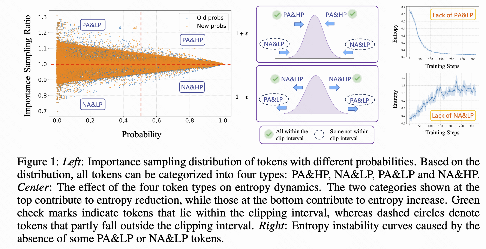
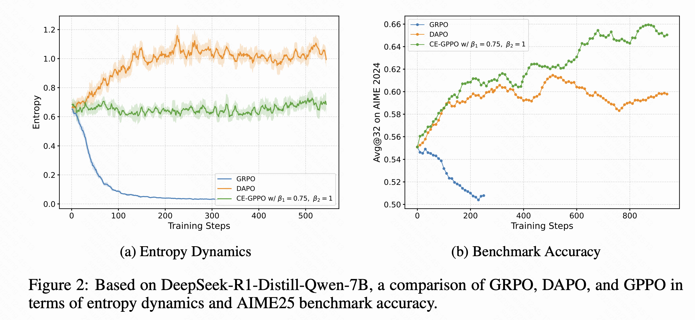

# ✨ CE-GPPO: Controlling Entropy Via Gradientpreserving Clipping Policy Optimization In Reinforcement Learning
We propose **Controlling Entropy via Gradient-Preserving Policy Optimization (CE-GPPO)**, a novel algorithm that reintroduces gradients from clipped tokens in native PPO in a gentle and bounded manner. By controlling the magnitude of gradients from tokens outside the clipping interval, CE-GPPO is able to achieve an explorationexploitation trade-off. We provide theoretical justification and empirical evidence showing that CE-GPPO effectively mitigates entropy instability. Extensive experiments on mathematical reasoning benchmarks show that CE-GPPO consistently outperforms strong baselines across different model scales.


<!-- ## 🚀 Quick Links
| Resource | Link |
|---|---|
| 📝 Preprints | [Paper](https://arxiv.org/pdf/2508.07629) |
| 🤗 Model Hub | [Klear-Reasoner-8B](https://huggingface.co/klear-team/klear-reasoner-8b-SFT) |
| 🤗 Model Hub | [Klear-Reasoner-8B](https://huggingface.co/klear-team/klear-reasoner-8b) |
| 🤗 Dataset Hub | [Math RL](https://huggingface.co/datasets/Suu/KlearReasoner-MathSub-30K) |
| 🤗 Dataset Hub | [Code RL](https://huggingface.co/datasets/Suu/KlearReasoner-CodeSub-Rllm-Cleaned) |
| 📄 Technical Report | [arXiv:250x.xxxxx](https://arxiv.org/abs/250x.xxxxx) |
| 🐛 Issues & Discussions | [GitHub Issues](https://github.com/klear-team/klear-reasoner/issues) |
| 📧 Contact | klear-reasoner@kuaishou.com |

--- -->

| Resource | Link |
|---|---|
| 📝 Preprints | [Paper](https://github.com/Kwai-Klear/CE-GPPO/blob/main/paper/CE-GPPO.pdf) |
| 🐛 Issues & Discussions | [GitHub Issues](https://github.com/Kwai-Klear/CE-GPPO/issues) |
| 📧 Contact | suzhenpeng13@163.com |

---


## 📌 Overview


## 📐 CE-GPPO (Controlling Entropy Via Gradientpreserving Clipping Policy Optimization In Reinforcement Learning)

## Motivation
<div align="center">

</div>

Reinforcement learning (RL) has become a central paradigm for fine-tuning large language models (LLMs). A key challenge lies in regulating **policy entropy**, which balances exploration and exploitation during training. Stable entropy is crucial: too little leads to premature convergence and loss of diversity (entropy collapse), while too much hinders convergence and wastes exploration (entropy explosion).

Our analysis shows that entropy dynamics arise from the interaction between the advantage function and the token probability distribution, which can be categorized into four patterns:

- **PA&HP** (Positive-Advantage High-Probability) and **NA&LP** (Negative-Advantage Low-Probability) tokens: reinforce dominant actions, accelerating convergence but driving entropy collapse.
- **PA&LP** (Positive-Advantage Low-Probability) and **NA&HP** (Negative-Advantage High-Probability) tokens: encourage exploration of unlikely actions, maintaining diversity and mitigating entropy collapse.

Standard PPO stabilizes training with clipping, but this mechanism discards gradients from low-probability tokens outside the clip interval. These overlooked signals, particularly from PA&LP and NA&LP tokens, are critical for entropy control. Ignoring them leads to unstable training:

- **Entropy collapse** arises when PA&LP gradients are suppressed, restricting exploration.
- **Entropy explosion** arises when NA&LP gradients are removed, overemphasizing exploration and delaying convergence.

To address this, we propose **CE-GPPO**, which reintroduces clipped gradients in a bounded and theoretically grounded way. By decoupling forward and backward passes with a stop-gradient operation and scaling coefficients, CE-GPPO incorporates gradients from out-of-clip tokens while preserving stability. This enables fine-grained entropy regulation and achieves a more effective balance between exploration and exploitation, preventing both collapse and explosion.

### 🔍 Key Features

- **Gradient Preservation**: Reintroduces gradients from clipped tokens (PA&LP and NA&LP) using stop-gradient and tunable scaling.
- **Entropy Stability**: Prevents entropy collapse and explosion by dynamically regulating gradient magnitudes.
- **Exploration-Exploitation Balance**: Allows controlled entropy stable, improving generalization and convergence.
- **SOTA Performance**: Outperforms strong baselines like GRPO, DAPO, CISPO, and GSPO on math reasoning benchmarks.

---

### 📊 Benchmark Results

| Model                        | AIME24 | AIME25 | HMMT25 | MATH500 | AMC23 | Avg  |
|-----------------------------|--------|--------|--------|---------|--------|------|
| DS-R1-Distill-Qwen-1.5B     | 29.2   | 24.1   | 13.1   | 86.0    | 73.7   | 45.2 |
| +GRPO                       | 33.4   | 28.1   | 16.6   | 88.3    | 79.3   | 49.1 |
| +DAPO                       | 40.0   | 28.4   | 19.17  | 90.0    | 84.4   | 52.4 |
| **+CE-GPPO**               | **42.0** | **33.9** | **21.6** | **91.0** | **85.9** | **54.9** |

| Model                        | AIME24 | AIME25 | HMMT25 | MATH500 | AMC23 | Avg  |
|-----------------------------|--------|--------|--------|---------|--------|------|
| DS-R1-Distill-Qwen-7B       | 54.5   | 39.1   | 26.2   | 93.6    | 90.6   | 60.8 |
| +GRPO                       | 55.3   | 40.3   | 24.5   | 93.7    | 88.8   | 60.5 |
| +DAPO                       | 59.7   | 48.7   | 25.6   | 95.1    | 93.4   | 64.5 |
| **+CE-GPPO**               | **66.0** | **51.4** | **30.5** | **95.6** | **93.8** | **67.5** |


<div align="center">

</div>

---

### 🧠 Why CE-GPPO?

- **Entropy Collapse**: Native PPO and GRPO often suffer from premature entropy decay, reducing output diversity.
- **Entropy Explosion**: Over-exploration can delay convergence and destabilize training.
- **Clipping Artifacts**: Ignoring clipped low-probability tokens removes valuable gradient signals.
- **Solution**: CE-GPPO reintroduces these signals in a **controlled**, **stable**, and **efficient** way.

### Implementation of GPPO

The complete loss implementation is as follows:
```python
def compute_gppo_loss_general_beta(
    old_log_prob,
    log_prob,
    advantages,
    response_mask,
    cliprange=None,
    cliprange_low=None,
    cliprange_high=None,
    clip_ratio_c=3.0,
    loss_agg_mode="token-mean",
    gppo_loss_beta1=0.75,
    gppo_loss_beta2=1.0
):
    """Adapted from https://github.com/huggingface/trl/blob/main/trl/trainer/ppo_trainer.py#L1122
    Args:
        old_log_prob: `(torch.Tensor)`
            shape: (bs, response_length)
        log_prob: `(torch.Tensor)`
            shape: (bs, response_length)
        advantages: `(torch.Tensor)`
            shape: (bs, response_length)
        response_mask: `(torch.Tensor)`
            shape: (bs, response_length)
        cliprange: (float)
            The clip range used in PPO. See https://arxiv.org/abs/1707.06347
        cliprange_low: (float)
            The lower clip range used in PPO.
        cliprange_high: (float)
            The higher clip range used in PPO.
        clip_ratio_c: (float) default: 3.0
            The lower bound of the ratio for dual-clip PPO, See https://arxiv.org/pdf/1912.09729
        loss_agg_mode: (str) choices: "token-mean" /
                                      "seq-mean-token-sum" /
                                      "seq-mean-token-mean" /
                                      "seq-mean-token-sum-norm" /
            "token-mean" is the default behavior

    Returns:
        pg_loss: `a scalar torch.Tensor`
            policy gradient loss computed via PPO
        pg_clipfrac: (float)
            the fraction of policy gradient loss being clipped
        ppo_kl: (float)
            the estimated KL divergence between the latest updating policy and the old sampling policy
        pg_clipfrac_lower: (float)
            the fraction of policy gradient loss being clipped when the advantage is negative
    """
    assert clip_ratio_c > 1.0, (
        "The lower bound of the clip_ratio_c for dual-clip PPO should be greater than 1.0,"
        + f" but get the value: {clip_ratio_c}."
    )

    negative_approx_kl = log_prob - old_log_prob
    ratio = torch.exp(negative_approx_kl)
    ppo_kl = verl_F.masked_mean(-negative_approx_kl, response_mask)
    ratio_detached = ratio.detach()
    
    pg_losses1 = -advantages * ratio
    if cliprange_low is None:
        cliprange_low = cliprange
    if cliprange_high is None:
        cliprange_high = cliprange
        
    # case masks
    low_mask = (ratio < (1 - cliprange_low)) & (advantages < 0)
    high_mask = (ratio > (1 + cliprange_high)) & (advantages > 0)
    other_mask = ~(low_mask | high_mask)
    
    beta1 = gppo_loss_beta1
    beta2 = gppo_loss_beta2
    
    # three cases
    clip_pg_losses1 = torch.zeros_like(advantages)
    clip_pg_losses1[low_mask] = -beta1 * (1 - cliprange_low) / ratio_detached[low_mask] * ratio[low_mask] * advantages[low_mask]
    clip_pg_losses1[high_mask] = -beta2 * (1 + cliprange_high) / ratio_detached[high_mask] * ratio[high_mask] * advantages[high_mask]
    clip_pg_losses1[other_mask] = -ratio[other_mask] * advantages[other_mask]

    pg_clipfrac = verl_F.masked_mean((low_mask | high_mask).float(), response_mask)

    pg_losses3 = -advantages * clip_ratio_c

    clip_pg_losses2 = torch.min(pg_losses3, clip_pg_losses1)
    pg_clipfrac_lower = verl_F.masked_mean(
        torch.gt(clip_pg_losses1, pg_losses3) * (advantages < 0).float(), response_mask
    )

    pg_losses = torch.where(advantages < 0, clip_pg_losses2, clip_pg_losses1)
    pg_loss = agg_loss(loss_mat=pg_losses, loss_mask=response_mask, loss_agg_mode=loss_agg_mode)

    return pg_loss, pg_clipfrac, ppo_kl, pg_clipfrac_lower
```

---

## 🧪 Training
### Configure the experimental environment
```bash
git clone https://github.com/Kwai-Klear/CE-GPPO
cd CE-GPPO
pip install -e .
pip install -r requirements.txt
```
For the code, we use [Firejail](https://github.com/netblue30/firejail) for the **sandbox** environment. Additionally, we implemented multi-process control based on [Pebble](https://github.com/noxdafox/pebble), enabling automatic resource reclamation upon task timeout. For mathematics, we use [math_verify](https://github.com/huggingface/Math-Verify) for judging.

### Download a pre-trained checkpoint & data
We trained our model based on [DeepSeek-R1-Distill-Qwen-7B](https://huggingface.co/deepseek-ai/DeepSeek-R1-Distill-Qwen-7B) and [DeepSeek-R1-Distill-Qwen-1.5B](https://huggingface.co/deepseek-ai/DeepSeek-R1-Distill-Qwen-1.5B), using the [KlearReasoner-MathSub-30K](https://huggingface.co/datasets/Kwai-Klear/KlearReasoner-MathSub-30K) dataset for training, with [AIME2024](https://github.com/Kwai-Klear/CE-GPPO/blob/main/benchmarks/aime960_math_verify.json) and [AIME2025](https://github.com/Kwai-Klear/CE-GPPO/blob/main/benchmarks/aime960_math_verify25.json) as the validation sets.

### Using Ray for Multi-Node Training
For multi-node training​​, ensure ​​all nodes are started and connected via Ray​​ before executing the training script. Below is a brief setup guide for Ray across multiple machines:
#### Step 1: Start Ray on the Head Node (node0)

On the first node (typically called `node0`), run:

```bash
ray start --head --dashboard-host=0.0.0.0
```

Get the IP address of the master node.
```bash
MASTER_IP=$(hostname -I | awk '{print $1}')
```
#### Step 2: Connect Other Nodes (e.g., node1)

On each additional worker node (e.g., `node1`), run the following, replacing the IP with that of your head node:

```bash
ray start --address=\"$MASTER_IP:6379\"
```

### RL Training
Run the following script on the master node to start the training task.


```bash
bash recipe/dapo/perf_run_dapo_ours_math.sh # For Math RL
bash recipe/dapo/perf_run_dapo_ours_code.sh # For Code RL
```

In the startup script, you need to set the following variables:
```bash
YOUR_MODEL_PATH="<your_model_path>"
CKPTS_SAVE_DIR="<ckpts_save_path>"
YOUR_TRAIN_FILE="<train_data_path>"
YOUR_TEST_FILE="<test_data_path>"
```


---
## 🤝 Citation
If you find this work helpful, please cite our paper:
```bibtex
@article{DBLP:journals/corr/abs-2508-07629,
  author       = {Zhenpeng Su and
                  Leiyu Pan and
                  Xue Bai and
                  Dening Liu and
                  Guanting Dong and
                  Jiaming Huang and
                  Wenping Hu and
                  Fuzheng Zhang and
                  Kun Gai and
                  Guorui Zhou},
  title        = {Klear-Reasoner: Advancing Reasoning Capability via Gradient-Preserving
                  Clipping Policy Optimization},
  journal      = {CoRR},
  volume       = {abs/2508.07629},
  year         = {2025},
  url          = {https://doi.org/10.48550/arXiv.2508.07629},
  doi          = {10.48550/ARXIV.2508.07629},
  eprinttype    = {arXiv},
  eprint       = {2508.07629},
  timestamp    = {Sat, 13 Sep 2025 14:46:27 +0200},
  biburl       = {https://dblp.org/rec/journals/corr/abs-2508-07629.bib},
  bibsource    = {dblp computer science bibliography, https://dblp.org}
}
```


